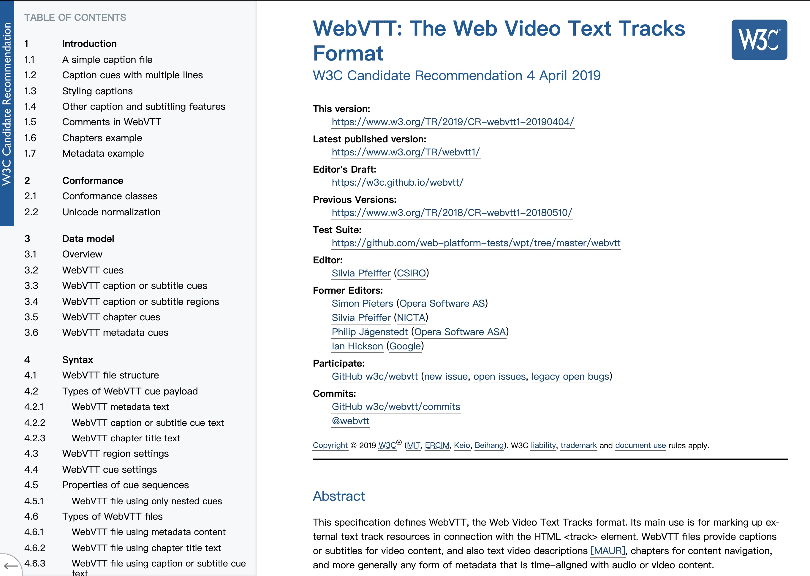

# VTT Test File
Here is a bunch of `.vtt` file.    
All of them follow this specification:   
[WebVTT: The Web Video Text Tracks Format](https://www.w3.org/TR/webvtt1/)

## Purpose
Testing

## Who can benefit from this?
* Developer.
* Developer who needs to write a program to deal with `.vtt` file.

## What kind of benefit?
Save time

## Why I created this
I built a Desktop app called [Tern - Subtitle File Translator](http://tern.1c7.me/)  
It can read `.srt` `.ass` `.vtt` and translate them into another langauge.(For example, French to English)  
It's like a `Google Translator Toolkit` replacement

I have to parse `.vtt` file.  
To make sure my program work with all kind of `.vtt` file.     
I create/collected these.  

I open source it so everyone can save time.